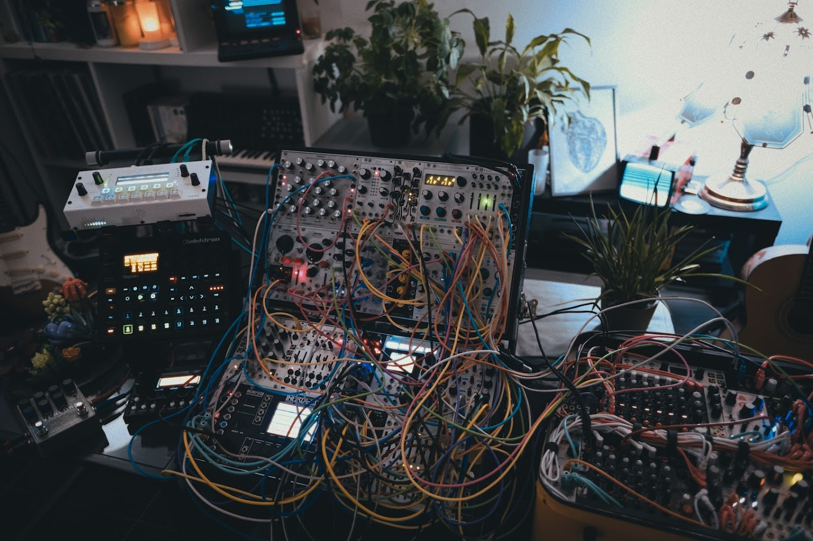

Hi,

I'm a french SRE / DevOps / CloudOps / System Engineer / Architect, former
Network Engineer, working in the infrastructure team of [Radio
France](https://radiofrance.fr) called "Fondation". We are hosting the websites
and building the [streaming
platform](https://github.com/radiofrance/rf-liquidsoap/) with open source
technologies. I spend a lot of time thinking about industrialisation and
workflow optimization.

During the other half of my days~nights and holydays I am an audiovisual creator
and musician performing under the name [SCHEMATiC
WiZARD](https://www.instagram.com/schematicwizard/). I've been releasing various
bleeps and bloops since 2010, trying to focus on modular synthesis and IDM music
since 2017 an doing art installations and eurorack liveshows since 2022. I like
to build things with obsolete technologies like Minitel, game consoles, radio
waves and hooking with cables and communication protocols a lot of machines so
they can talk and play together. After spending years with getting frustrated
with hardware sequencers I am now treating my eurorack synth like a big VST.

I'm the co-founder of an audiovisual collective called
[null.part](https://www.youtube.com/@nullpart) where I play music and make my
best to help machines and humans getting linked together. I'm also an active
member of the [RiCO
Collectif](https://www.instagram.com/rico.collectif/), a modular synth oriented
association doing live events in Paris, FR.

In 2024 I started working on an obscure creative experiment/framework/archive
called [Bill of Materials](https://github.com/bill-of-materials). Thanks for
passing by and feel free to reach on any social network.

[Bluesky](https://bsky.app/profile/billofmaterials.art)

[Mastodon](https://merveilles.town/@schematicwizard)

[Instagram](https://www.instagram.com/schematicwizard/)

[Soundcloud](https://soundcloud.com/schematic-wizard)

[Youtube](https://www.youtube.com/@schematicwizard)
